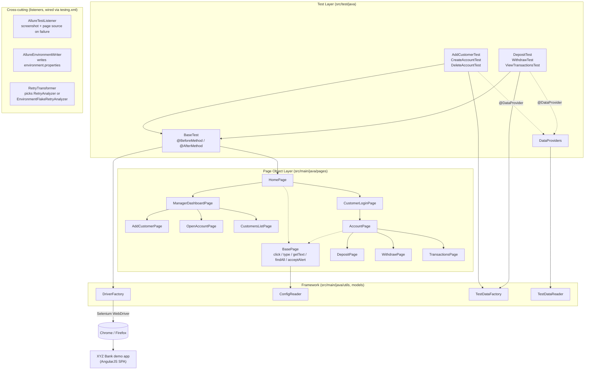
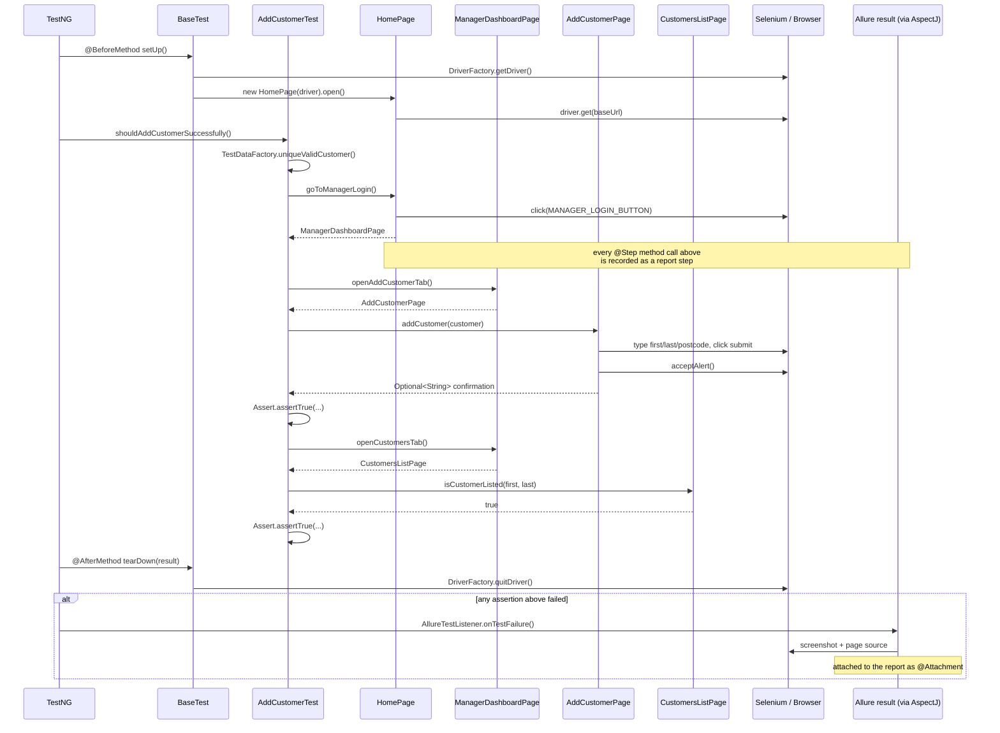
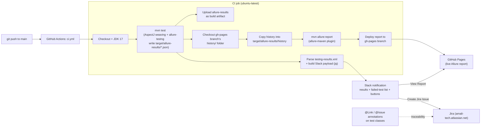

# Architecture

A high-level map of how a test runs, how Allure captures it, and how the report reaches Slack and GitHub Pages. Three diagrams: the components and how they call each other, one concrete test executing end to end, and the CI/CD + reporting pipeline.

## 1. Component Map

- **Tests** never touch Selenium directly — they call page objects and assert on what comes back.
- **Page objects** form a navigation chain: each action method returns the *next* page object, so a test reads like the user journey it's automating (`homePage.goToManagerLogin().openAddCustomerTab().addCustomer(customer)`).
- **`BasePage`** (in its own `base` package, a sibling of `pages` — mirroring `BaseTest`) holds the only code that talks to Selenium's `WebDriverWait`/`By` primitives; every concrete page extends it instead of repeating wait logic.
- **Listeners** aren't called by any of the above directly — TestNG invokes them automatically via `testng.xml`'s `<listeners>` block, on every test regardless of which class it's in.

## 2. One Test, End to End

`AddCustomerTest.shouldAddCustomerSuccessfully` — chosen because it touches every layer once.

- Every `@Step`-annotated method call (almost every page-object action) is intercepted by the AspectJ weaver and recorded into the in-progress Allure result — that's how a failure's report shows exactly which UI step broke, not just which test method.
- The `alt` block only fires on failure; on a pass, `AllureTestListener` never runs and no screenshot is taken.
- Data-driven tests (`shouldRejectInvalidCustomer`, `shouldHandleDepositAmount`, `shouldHandleWithdrawalAmount`) repeat this same shape once per `@DataProvider` row, each becoming its own entry in the report.

## 3. Reporting & CI/CD Pipeline

- **`mvn test`** is the only step that touches Selenium/Chrome; every step after it just processes files that step produced (`target/allure-results`, `target/surefire-reports/testng-results.xml`).
- **History seeding** is why the deployed report's trend graphs (History/Duration/Retries/Categories Trend) show a multi-build line — each CI run pulls forward the previous run's history before generating, so trend data accumulates across builds instead of resetting. A local `mvn allure:report` skips this step, so those same trend graphs show "There is nothing to show" when generated locally with no history to draw a line through.
- **Slack and the report are independent outputs** of the same run — the report publishes to `gh-pages` regardless of whether the Slack step succeeds, and vice versa (`if: always()` on every post-test step).
- **Jira traceability** is static, not generated at CI time: `@Link`/`@Issue` annotations on the test classes point at `JiraLinks` constants, which Allure renders as clickable links using the `allure.link.issue.pattern`/`allure.link.tms.pattern` configured in `allure.properties`.

## 4. Directory Reference

| Path | Responsibility |
|---|---|
| `src/main/java/com/xyzbank/base/BasePage.java` | Shared Selenium primitives every page object extends |
| `src/main/java/com/xyzbank/pages/` | One class per screen/sub-view |
| `src/main/java/com/xyzbank/models/` | POJOs mirroring the JSON test-data fixtures |
| `src/main/java/com/xyzbank/utils/` | `DriverFactory`, `ConfigReader`, `TestDataReader`, `TestDataFactory` |
| `src/main/java/com/xyzbank/listeners/` | Allure screenshot/environment listeners, retry analyzers |
| `src/test/java/com/xyzbank/base/BaseTest.java` | Driver lifecycle + shared multi-step preconditions |
| `src/test/java/com/xyzbank/providers/` | `@DataProvider` methods (read fixtures, never hardcode data) |
| `src/test/java/com/xyzbank/jira/JiraLinks.java` | Central Jira/Xray keys referenced by `@Link`/`@Issue` |
| `src/test/java/com/xyzbank/tests/` | `manager/` and `customer/` test classes |
| `src/test/resources/testdata/*.json` | Business/domain test data |
| `src/test/resources/suites/testng.xml` | Suite entry point Maven Surefire runs; registers the listeners |
| `.github/workflows/ci.yml` | The pipeline in §3 |
